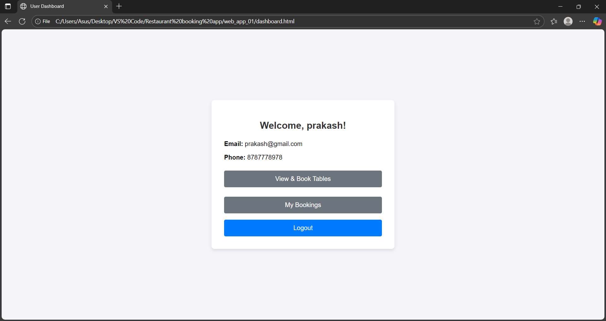
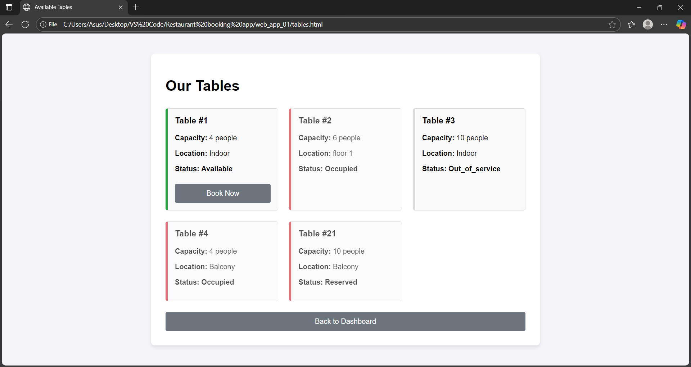
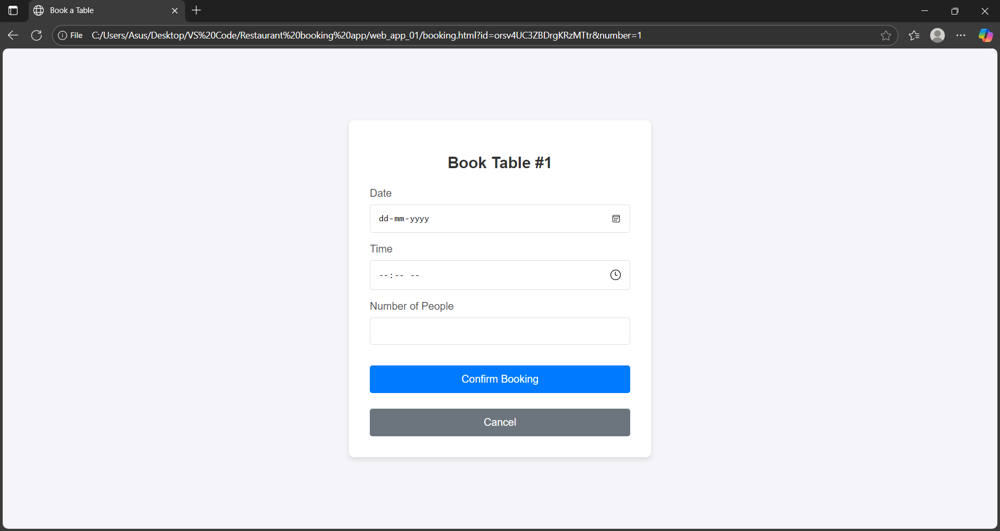
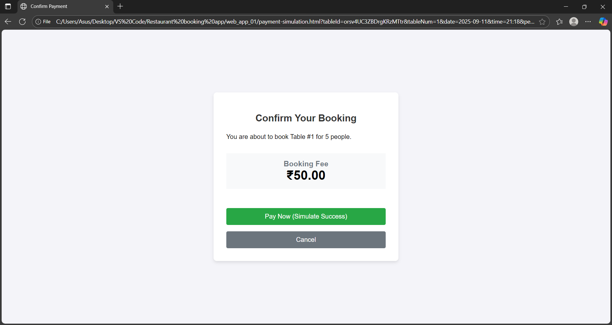
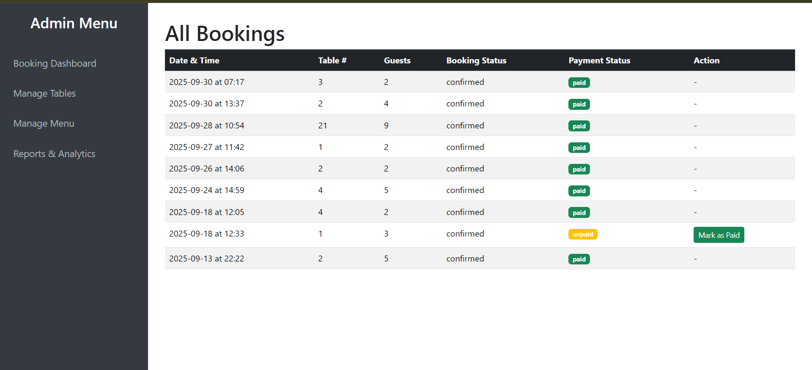
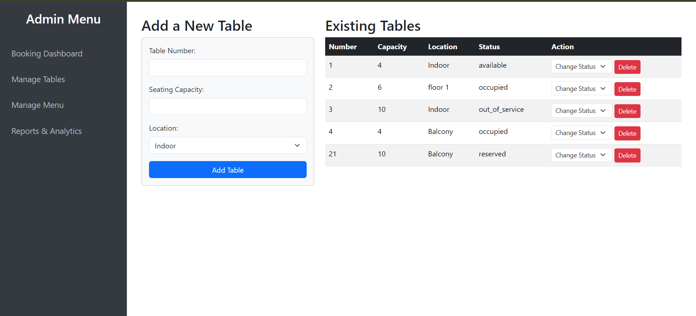
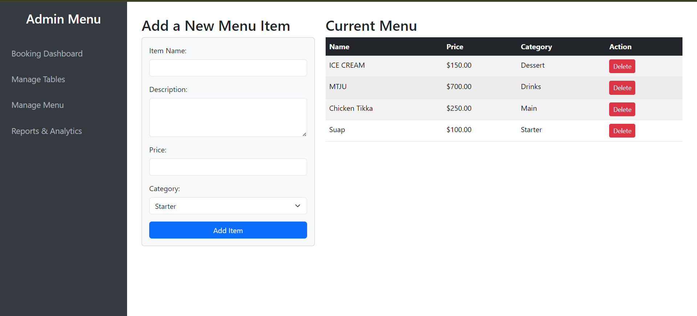

# Restaurant Table Booking System

A full-stack web application for booking restaurant tables, featuring a complete customer-facing interface and a powerful admin panel for management.


## Features

### 👤 Customer Web App
- **User Authentication:** Secure sign-up and login functionality.
- **Live Table View:** View a list of all restaurant tables and their real-time status (Available, Reserved).
- **Booking System:** A simple form to book an available table for a specific date, time, and party size.
- **Payment Simulation:** A "Pay at Venue" flow that simulates a successful payment and generates a booking confirmation.
- **My Bookings Page:** A personal dashboard for users to view their past and upcoming reservations, which also acts as their booking receipt.
- **Mobile-Responsive:** The design adapts to look great on both desktop and mobile devices.

### ⚙️ Admin Panel (Python/Flask)
- **Dashboard:** A central view of all bookings, sorted by date.
- **Table Management:** A CRUD interface to Add, View, Update (status), and Delete restaurant tables.
- **Menu Management:** A CRUD interface to Add, View, and Delete menu items.
- **Payment Confirmation:** Staff can mark bookings as "Paid" when customers pay at the restaurant.
- **Reports & Analytics:** A dashboard displaying key business metrics like total bookings, today's bookings, peak hours, and most popular tables.

---

## Tech Stack

- **Frontend:** HTML5, CSS3, JavaScript
- **Backend:** Python (Flask)
- **Database:** Google Firestore (NoSQL)
- **Authentication:** Firebase Authentication
- **Deployment:** Firebase Hosting (for Frontend), Google Cloud Run (for Backend)

---

## Screenshots

Below are some screenshots of the application:

### Customer Web App






### Admin Panel





## Setup Instructions

### 1. Python Environment Setup
```bash
# Create a virtual environment
python -m venv venv

# Activate virtual environment
# For Windows:
venv\Scripts\activate
# For Linux/Mac:
source venv/bin/activate

# Install dependencies
pip install -r requirements.txt
```

### 2. Firebase Configuration
Make sure you have your `serviceAccountKey.json` file in the restaurant_admin directory.

### 3. Running the Application

#### Admin Panel (Backend)
```bash
cd restaurant_admin
python app.py
```
The admin panel will run on `http://127.0.0.1:5000`

#### Customer Interface (Frontend)
For the customer-facing website, it's recommended to:
1. Navigate to the `customer_web_app` folder.
2. Right-click `index.html` and "Open with Browser".

## Project Structure
```
restaurant-booking-system/
├── restaurant_admin/       # Backend (Flask)
│   ├── app.py
│   ├── templates/          # Frontend HTML files
│   ├── serviceAccountKey.json
│   └── requirements.txt
│   
├── customer_web_app/
│     # Frontend HTML files
│   
└── README.md
```

## Important Notes
- Always run the web application from the project's folder
- Keep the admin panel (Flask backend) running while using the customer interface
- Make sure both the frontend and backend servers are running simultaneously
- The admin interface is accessible through VS Code
- Use different ports for frontend (5500) and backend (5000) to avoid conflicts

## Troubleshooting
- If you get module not found errors, ensure you've activated the virtual environment
- If Firebase connection fails, verify your serviceAccountKey.json is properly configured
- For CORS issues, ensure both servers are running and properly configured
### Prerequisites
- Python 3.x
- Node.js and npm
- Firebase CLI

### Frontend (Customer Web App)
1. Navigate to the `customer_web_app` folder.
2. Right-click `index.html` and "Open with Browser".

### Backend (Admin Panel)
1. Navigate to the `restaurant_admin` directory.
2. Create a virtual environment: `python -m venv venv`
3. Activate it: `source venv/bin/activate` (Mac/Linux) or `venv\Scripts\activate` (Windows)
4. Install dependencies: `pip install Flask firebase-admin Flask-Cors`
5. Place your `serviceAccountKey.json` from Firebase in this directory.
6. Run the app: `python app.py`
7. The admin panel will be available at `http://127.0.0.1:5000`

