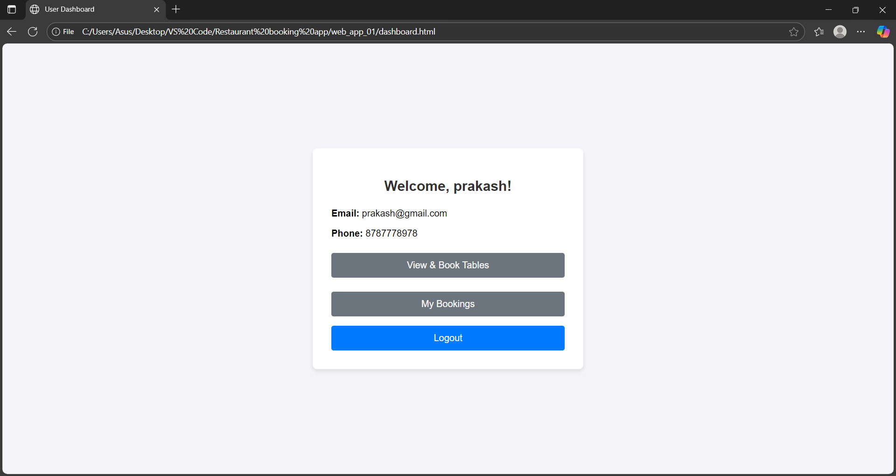
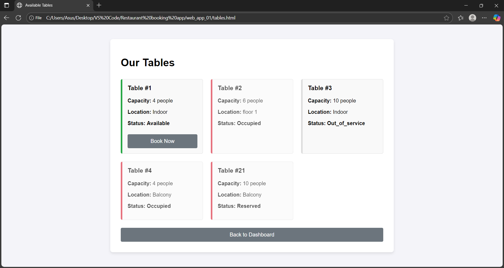
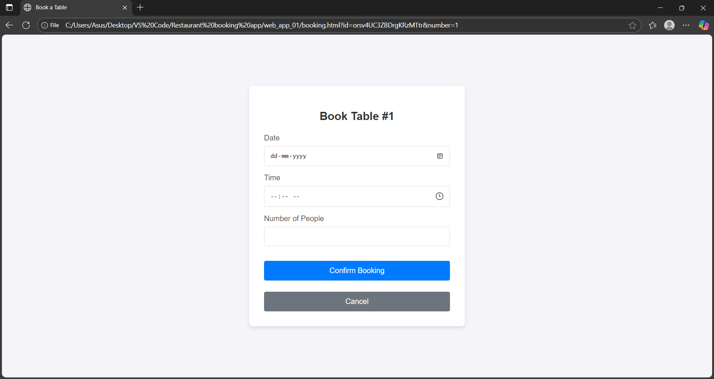
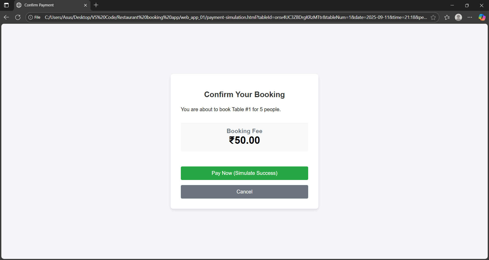
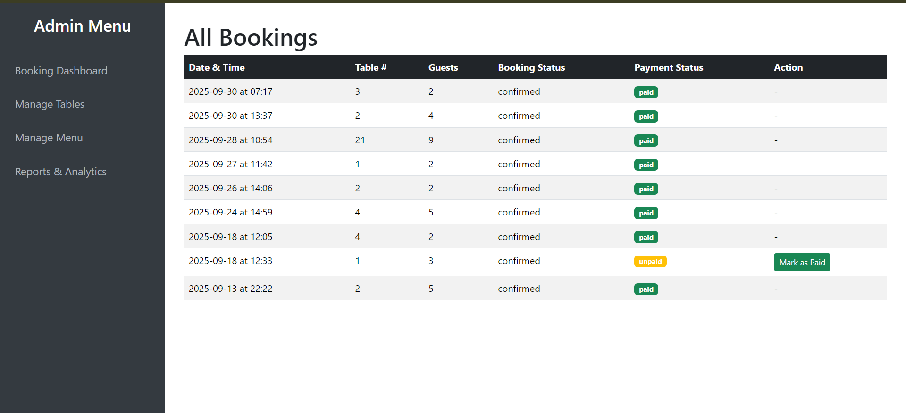
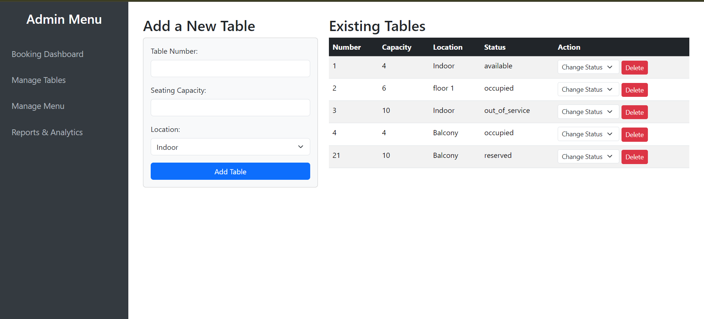
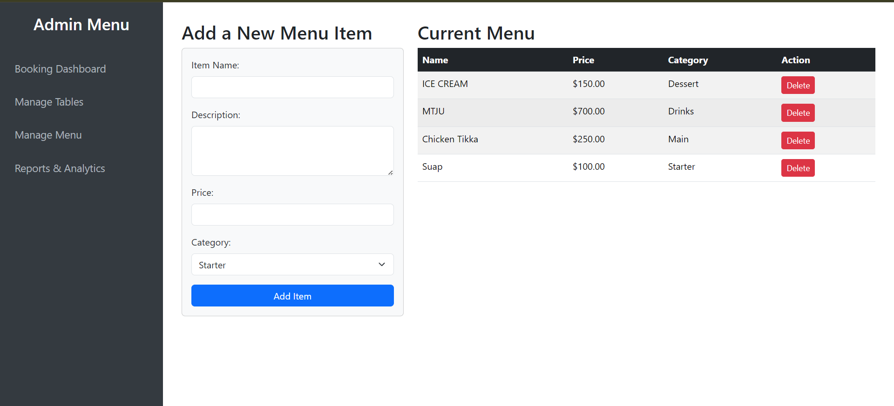

# 🍽️ Restaurant Table Booking System

A full-stack restaurant reservation and management platform that enables customers to book tables online while providing restaurant staff with a comprehensive administration dashboard for managing reservations, tables, menus, payments, and business analytics.

---

## Overview

Restaurant Table Booking System is designed to streamline restaurant operations by digitizing table reservations and providing real-time booking management.

The platform consists of:

* A customer-facing reservation portal
* A secure administration dashboard
* Real-time table availability management
* Reservation tracking and reporting

This solution helps restaurants reduce manual booking errors, improve customer experience, and gain insights into booking trends.

---

## Key Features

### 👤 Customer Portal

#### User Authentication

* Secure account registration
* User login and session management
* Firebase Authentication integration

#### Online Table Reservation

* View available tables
* Real-time table status updates
* Date and time selection
* Party size management

#### Booking Management

* View upcoming reservations
* Access booking history
* Reservation confirmations
* Digital booking receipts

#### Payment Flow

* Pay-at-venue booking process
* Booking confirmation generation
* Payment status tracking

#### Responsive Design

* Mobile-friendly interface
* Tablet compatibility
* Desktop optimization

---

### ⚙️ Administration Dashboard

#### Reservation Management

* View all bookings
* Filter reservations by date
* Manage customer reservations
* Booking status monitoring

#### Table Management

* Create new tables
* Update table status
* Remove inactive tables
* Track table availability

#### Menu Management

* Add menu items
* Remove menu items
* Manage restaurant offerings

#### Payment Verification

* Confirm completed payments
* Update payment status
* Reservation validation

#### Business Analytics

* Total reservations
* Daily booking statistics
* Peak booking hours
* Most popular tables
* Reservation trends

---

## Technology Stack

### Frontend

| Technology | Purpose                   |
| ---------- | ------------------------- |
| HTML5      | Application Structure     |
| CSS3       | Styling                   |
| JavaScript | Client-side Functionality |

### Backend

| Technology | Purpose              |
| ---------- | -------------------- |
| Python     | Backend Logic        |
| Flask      | Web Framework        |
| Flask-CORS | Cross-Origin Support |

### Cloud Services

| Service                 | Purpose             |
| ----------------------- | ------------------- |
| Firebase Authentication | User Authentication |
| Google Firestore        | NoSQL Database      |
| Firebase Hosting        | Frontend Hosting    |
| Google Cloud Run        | Backend Deployment  |

---

## System Architecture

```text
Customer
 │
 ▼
Customer Web Portal
 │
 ▼
Firebase Authentication
 │
 ▼
Flask Backend API
 │
 ├── Reservation Management
 ├── Table Management
 ├── Payment Processing
 ├── Reporting Module
 │
 ▼
Google Firestore
```

---

## Screenshots

### Customer Portal

#### Welcome Page



#### Table Booking



#### Reservation Management



#### Payment Confirmation



---

### Administration Dashboard

#### Reservation Dashboard



#### Table Management



#### Menu Management



#### Reports & Analytics


---

## Project Structure

```text
restaurant-booking-system/
│
├── restaurant_admin/
│   ├── app.py
│   ├── templates/
│   ├── static/
│   ├── requirements.txt
│   └── serviceAccountKey.json
│
├── customer_web_app/
│   ├── index.html
│   ├── css/
│   ├── js/
│   └── assets/
│
├── screenshots/
├── README.md
└── LICENSE
```

---

## Installation

### Clone Repository

```bash
git clone https://github.com/prakashgangurde-ux/restaurant-table-booking-system.git

cd restaurant-table-booking-system
```

---

## Backend Setup

Create virtual environment:

```bash
python -m venv venv
```

Activate:

Windows:

```bash
venv\Scripts\activate
```

Linux/macOS:

```bash
source venv/bin/activate
```

Install dependencies:

```bash
pip install -r requirements.txt
```

Install required packages:

```bash
pip install Flask firebase-admin Flask-Cors
```

---

## Firebase Configuration

Place:

```text
serviceAccountKey.json
```

inside:

```text
restaurant_admin/
```

Configure:

* Firebase Authentication
* Firestore Database
* Hosting (optional)

---

## Running the Application

### Start Backend

```bash
cd restaurant_admin

python app.py
```

Backend URL:

```text
http://127.0.0.1:5000
```

---

### Start Frontend

Navigate to:

```text
customer_web_app/
```

Open:

```text
index.html
```

using:

* VS Code Live Server
* Local web server
* Browser

Recommended frontend port:

```text
5500
```

---

## Business Benefits

### For Customers

* Faster reservations
* Online booking convenience
* Reservation history access
* Mobile-friendly experience

### For Restaurant Staff

* Centralized reservation management
* Reduced manual booking errors
* Simplified table tracking
* Better operational visibility

### For Restaurant Owners

* Reservation analytics
* Peak-hour analysis
* Popular table insights
* Business performance tracking

---

## Future Enhancements

* Online payment gateway integration
* QR-based table check-in
* SMS and email notifications
* Multi-branch support
* Loyalty rewards system
* Customer feedback module
* AI-powered reservation forecasting

---

## Security Features

* Firebase Authentication
* Protected admin dashboard
* Firestore access controls
* Secure session handling

---

## License

MIT License

Free for personal, educational, and commercial use.

---

## Author

Prakash Gangurde

GitHub:
https://github.com/prakashgangurde-ux

Full-Stack Developer specializing in web applications, business systems, and cloud-integrated solutions.
